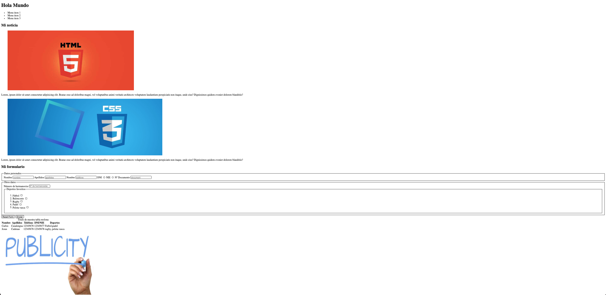
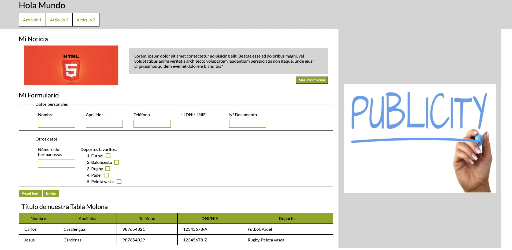
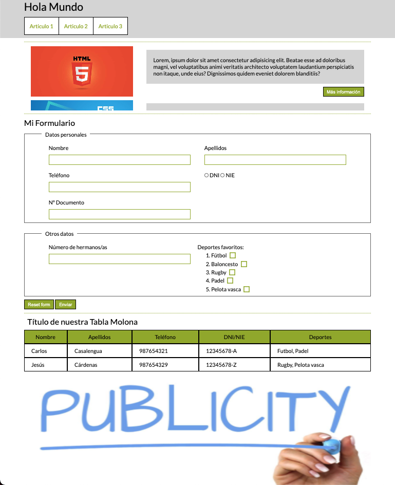

# Formación Academia DEX HTML-CSS-SASS-ACCESIBILIDAD-JAVASCRIPT

Esta formación constará de 6 prácticas en las que aprenderemos a dominar los siguientes conocimientos:
- HTML
- CSS
- SASS
- Boostrap
- Accesibilidad
- Javascript

Cada uno de estos apartados contarán con una rama donde podras encontrar un documento teórico en el que respaldarse para enfrentarse a los ejercicios y su posterior revisión donde además abordaremos las mejores prácticas de desarrollo en el día a día. Estos ejercicios son escalables de manera que siempre partiremos de la anterior solución. En cada una de las ramas existira un tag solución para poder continuar a la siguiente en caso de no haber realizado con exito la anterior práctica.

## Práctica HTML

La raíz del ejercicio parte de la rama ```html-block```, de modo que deberéis cambiaros a dicha rama y traeros los cambios. Teniendo en cuenta la siguiente imagen, crea la estructura HTML tomando como referencia los criterios semanticos que se abordan en las [diapositivas](https://docs.google.com/presentation/d/1FKjEjaU89Tim9S9s8mw3TOjHlcpR00YXtwLWvOdxcRM) del bloque formativo. Los recursos necesarios para la realización del ejercicio se encuentren en el mismo repositorio, considera cual deberia ser la correcta estructura de archivos, ten en cuenta que dicha práctica es escalable y el punto de partida de cada sesión dependera de la anterior.



## Práctica CSS
La raíz del ejercicio parte de la rama ```css-block```, de modo que deberéis cambiaros a dicha rama y traeros los cambios. Teniendo en cuenta la siguiente imagen, crea la estructura HTML tomando como referencia los criterios semanticos que se abordan en las [diapositivas](https://docs.google.com/presentation/d/1FKjEjaU89Tim9S9s8mw3TOjHlcpR00YXtwLWvOdxcRM) del bloque formativo. Los recursos necesarios para la realización del ejercicio se encuentren en el mismo repositorio, considera cual deberia ser la correcta estructura de archivos.

Teniendo en cuenta la siguiente imagen, estiliza la estructura HTML para obtener un retrato fiel de la misma. 


## Ejercicio 1
Crea una grid para establecer los anchos máximos en cada una de las resoluciones:
- sm: mobile desde 0px
- md: tablet desde 768px
- lg: desktop desde 1200px

El visual en responsive deberia verse de la siguiente manera:


## Ejercicio 2
Accede al siguiente [enlace](https://fonts.google.com/specimen/Lato#glyphs) y descargate la fuente de texto, una vez hecho insertala en el proyecto y comprueba que el navegador la trae correctamente.

## Ejercicio 3
Modifica los checkbox de manera que aparezcan las imagenes ```i-checkbox-checked.svg``` y ```i-checkbox-unchecked.svg``` en función del estado del input. Una vez insertadas las nuevas imagenes, deberia darte como resultado lo siguiente:


### BONUS
Convierte estas dos imagenes en una fuente de texto y aplicalas en los checkbox. Para crear la fuente puedes hacerlo desde la siguiente [herramienta](https://icomoon.io/app/#/projects)

## Ejercicio 4
En el apartado de los articulos especifica un max-height al bloque contenedor y controla el desbordamiento de forma que se pueda visualizar por medio de un scroll.

### BONUS
Genera un ancla en los distintos items del menu de navegación, donde al clickar en cada uno de ellos el bloque contenedor de los articulos haga una animación de scroll hacia el articulo concreto.

## Prácticas SASS

## Ejercicio 1
1. Dada la estructura base, analizar el archivo _index.html_ y migrar la nomenclatura bajo la metodología BEM, clonando estas nuevas clases en el archivo _assets/css/style.css_
2. Una vez hecho esto comprobar el visual

## Ejercicio 2
Con las clases CSS bajo la nomenclatura BEM, es momento de crear una estructura ITCSS. Lo haremos usando nomenclatura SASS y empezaremos a jugar con la compilación.
1. Instalamos sass `npm i -g sass`
2. Creamos las carpetas con sus respectivos archivos definidos por ITCSS
3. En el package.json, creamos el script que ejecutará la compilación, basandonos en la [Command-line Interface](https://sass-lang.com/documentation/cli/dart-sass) del propio sass.
4. Comprobamos que no haya cambiado nada en el visual

## Ejercicio 3
1. Analiza tu arquitectura y crea variables SASS para hacer configurable el proyecto. Prueba a cambiar el tamaño a los textos para comprobarlo
2. Crea un mixin de fuentes para que con cada `@include`, generes una nueva. _Reto:_ Hazlo por medio de un bucle
3. Dada la siguiente lista de iconos, ubicala donde creas y genera tantas clases como nombres tenga la lista donde corresponda.
~~~
  first-page: "\e92d",
  last-page: "\e92e",
  button-success: "\e92c",
  table-options: "\e92b",
  mouse-square: "\e928",
  mouse-circle: "\e929",
  responsive-table: "\e92a",
  arrow-down: "\e916",
  arrow-up: "\e917",
  button-delete: "\e918",
  cloud-download: "\e919",
  delete: "\e91a",
  edit: "\e91b",
  email: "\e91c",
  facebook: "\e91d",
  grid-system: "\e91e",
  instagram: "\e91f",
  linkedin: "\e920",
  lock-close: "\e921",
  lock-open: "\e922",
  menu-option: "\e923",
  share: "\e924",
  twitter: "\e925",
  user-logged: "\e926",
  youtube: "\e927",
  eye-iluminated: "\e915",
  menu-mobile: "\e913",
  close: "\e914",
  arrow: "\e900",
  calendar: "\e901",
  checkbox-checked: "\e902",
  checkbox-checked-disabled: "\e903",
  checkbox-hover: "\e904",
  checkbox-indeterminate: "\e905",
  checkbox-indeterminate-disabled: "\e906",
  checkbox-unchecked: "\e907",
  checkbox-unchecked-disabled: "\e908",
  eye: "\e909",
  network: "\e90a",
  profile: "\e90b",
  radio-checked: "\e90c",
  radio-checked-disabled: "\e90d",
  radio-hover: "\e90e",
  radio-unchecked: "\e90f",
  radio-unchecked-disabled: "\e910",
  search: "\e911",
  tic: "\e912"
~~~
4. Crea una utilidad de margenes que por medio de un bucle obtengas las siguientes clases:

**Cuidado con el valor incremental de cada vuelta**
~~~
    .mt-sm-1{
        margin-top:5px
    }

    .mt-sm-2{
        margin-top:10px
    }...

    .mr-md-1{
        margin-right:5px;
    }

    .mr-md-2{
        margin-right:10px;
    }...
~~~
**_BONUS:_** Crea una grid configurable teniendo en cuenta el número,espaciado entre columnas y ancho de cada una. A continuación, haz un bucle para que te genere tantas clases como columnas tenga la grid, además de tener en cuenta los puntos de corte. PD: Si modifico el número de columnas, el número de clases generadas tendran que ser igual a esta. El resultado deberia ser el siguiente:
~~~
@media only screen and (min-width: 0) {
  .col-sm-1 {
    padding: 0 12px;
    box-sizing: border-box;
    flex: 0 0 8.3333333333%;
    min-width: 8.3333333333%;
    max-width: 8.3333333333%;
  }...
}

@media only screen and (min-width: 768px) {
  .col-md-1 {
    padding: 0 12px;
    box-sizing: border-box;
    flex: 0 0 8.3333333333%;
    min-width: 8.3333333333%;
    max-width: 8.3333333333%;
  }...
}

@media only screen and (min-width: 1200px) {
  .col-lg-1 {
    padding: 0 12px;
    box-sizing: border-box;
    flex: 0 0 8.3333333333%;
    min-width: 8.3333333333%;
    max-width: 8.3333333333%;
  }...
}
~~~


## Práctica BOOSTRAP
Se deberán modificar los estilos que sean necesarios para que se mantenga la misma estética inicial tras integrar la librería de boostrap.
## Ejercicio 1
1. Dada la estructura base, importar el link de los estilos de boostrap en nuestro index.html
2. Comprobar en el arbol dom, que la clase "container" esta cogiendo los estilos de boostrap y no de vuestro "style.scss"

## Ejercicio 2
1. Modificar el header a container-fluid, y SÓLO usando las clases de flex de boostrap (los cols son para el siguiente ejercicio) (https://getbootstrap.com/docs/5.0/utilities/flex/), disponer el h1 y el nav en columna en mobile, y en row dispuestos uno al lado del otro en desktop(md).
2. Alinear el h1 y el nav por el centro y posicionarlos uno en cada extremo del header en resolucion desktop(md). En mobile deberan mantanerse, una debajo del otro.
3. Maquetar con los cols la seccion del main y el aside para que queden en columna en mobile y tablet y en linea en resolución desktop.

## Ejercicio 3
1. Sustituir las card que hay dentro del article por el componente de boostrap "https://getbootstrap.com/docs/5.0/components/card/" manteniendo el punto de ancla del nav operativo, maquetar en columna para mobile y en linea para tablet y desktop.

## Ejercicio 4
1. Modificar el formulario para que quede a 1 columna en mobile, 3 en tablet y 2 desktop.

## Ejercicio 5
1. Modificar la tabla para que al ancho ocupe el disponible.

### BONUS###
Modificar los estilos pertinentes para que:
- el radio quede lo más alineado visualmente con el input que tiene al lado.
- se deje un espacio inferior entre campos y botones para que no queden tan pegados unos a otros.
- La caja verde de los checkbox quede alinada a la derecha en linea recta y el label en el aldo opuesto.

## Práctica Accesibilidad web
## Ejercicio 1
1. Usar el validador de html y css de la w3c, y analizar sus resultados(recordad que hay casos que nos os levantarán).

2. Añadir todos los atributos html que falten y modificar los necesarios. (Recordad que si una imagen es decorativa, su alt debe ir vacío y si contiene información relevante, deberá ir indicada en su alt).

3. Revisar que los literales que desencadenan acciones, tienen sentido o deberán cambiarse.(Pista: las acciones de nuestra web han de ser personalizadas para que el usuario sepa a cúal corresponde).

4. Revisar que las etiquetas html son correctas para el propósito que se está usando(lo que se conoce como semántica web)Por ejemplo: no tiene sentido usar etiquetas que indican mucha cantidad de texto, si sólo tenemos una línea.

## Ejercicio 2
1. Modificar la tabla existente, para que en mobile se disponga la información en bloque, y en tablet y desktop en fila. Deberá ser con la técnica del data-title para que "el responsive" sea accesible.

### Ejercicio 3
1. Convertir la tabla que hay, en una de divs y hacerla accesible y responsive con la técnica del ejercicio anterior y añadiendo la técnica ARIA.

### BONUS###

1. Añadir placeholders a los inputs para que favorezcan la accesibilidad del formulario.